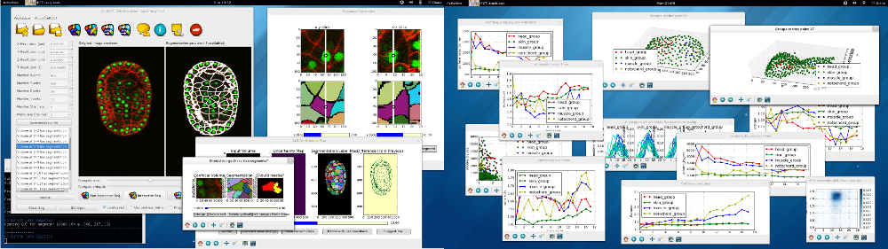

CellECT: Cell Evolution Capturing Tool
======================================

About
-----

CellECT is a tool for cell analysis in 3-D confocal microscopy membrane volumes. CellECT provides a segmentation tool, which runs seeded watershed on the volume, predicts uncertain areas and allows the user to interact with the segmentation in order to correct it. CellECT also provides a tracking tool for discovering cell lineage across multiple 3-D volumes.

Skip to [CellECT Segmentation Tool](https://github.com/ddiana/CellECT/tree/master/CellECT/seg_tool#cellect-segmentation-tool)

Skip to [CellECT Tracking Tool](https://github.com/ddiana/CellECT/tree/master/CellECT/track_tool#cellect-tracking-tool)

Installation
------------

CellECT is supported for Linux and MacOS, and was tested on Ubuntu 11.10, Ubuntu 12.04 and Fedora 18.

Prerequisites:

* python 2.7
* numpy 1.6.1
* scipy 0.10.0
* python-image
* matplotlib 1.1.1 or above
* pyml 0.7.10 (and libsvm)
* termcolor
* pylibtiff (and libtiff)
* pyside wrapper for Qt
* opencv python wrappers
* matlab (needed for imimposemin, watershed)

An install script tested on Fedora 18 is provided [here](https://github.com/ddiana/CellECT/blob/master/prereqs_install_fedora.sh)

After the prerequisites, CellECT can be installed as follows:

```
python setup.py build
python setup.py install
```

Running CellECT
----------------

CellECT can be run from command line:

```
CellECT
```


CellECT can work with TIFF stacks which contain membrane channel (and optionally nuclei channel), at one or multiple time points. You can create a workspace from a new TIFF dataset, or you can open an existing workspace and continue working with it. A new workspace will optionally take as input the output of a nuclear detector as a .csv file. If no such file is provided, the user can manually add points later, or or opt for randomized input points.




License and Disclaimer
======================

**Author:**

[Diana Delibaltov](http://ece.ucsb.edu/~diana), Ph.D. student at the [Vision Research Lab](http://vision.ece.ucsb.edu) at University of California, Santa Barbara.


**License:**


**Disclaimer:**

I assume no responsibility for any effect this software may have on you,
your family, pet, computer, or anything else related to you or your existance.
No warranty provided nor implied.

