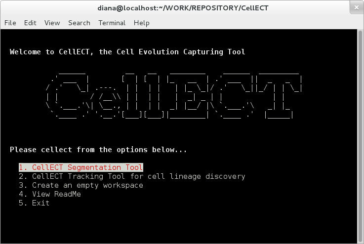
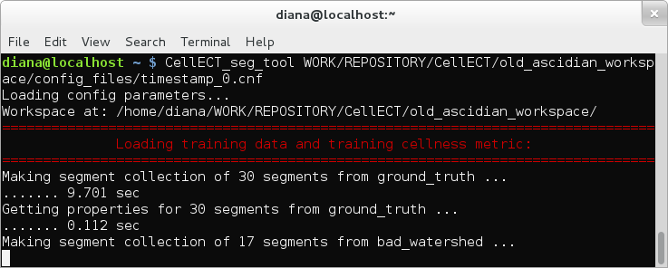
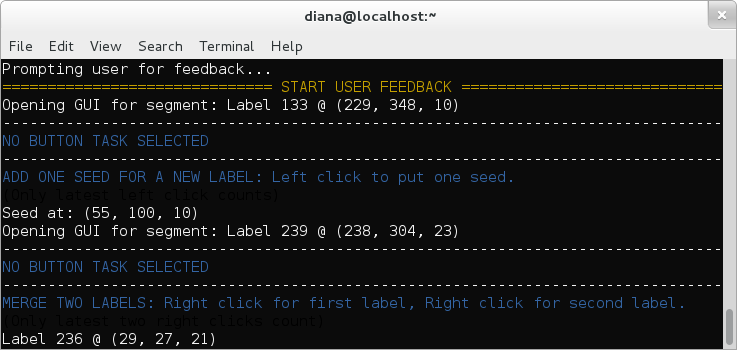
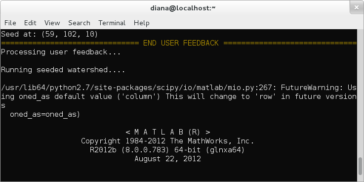

CellECT: Cell Evolution Capturing Tool
======================================

About
-----

CellECT is a tool for cell analysis in 3-D confocal microscopy membrane volumes. CellECT provides a segmentation tool, which runs seeded watershed on the volume, predicts uncertain areas and allows the user to interact with the segmentation in order to correct it. CellECT also provides a tracking tool for discovering cell lineage across multiple 3-D volumes.

Skip to [CellECT Segmentation Tool](https://github.com/ddiana/CellECT#cellect-segmentation-tool)

Skip to [CellECT Tracking Tool](https://github.com/ddiana/CellECT#cellect-tracking-tool)

Installation
------------

CellECT is supported for Linux and MacOS, and was tested on Ubuntu 11.10, Ubuntu 12.04 and Fedora 18.

Prerequisites:

* python 2.7
* numpy 1.6.1
* scipy 0.10.0
* python-image
* matplotlib 1.1.1 or above
* pyml 0.7.10 (and libsvm)
* termcolor
* matlab (needed for imimposemin, watershed)

After the prerequisites, CellECT can be installed as follows:

```
python setup.py build
python setup.py install
```

Running CellECT
----------------

CellECT can be run from command line:

```
CellECT [path-to-config-file]
```

The configuration file is optional and is passed to the segmentation tool if this option is selected. Otherwise, if not configuration file is provided and the segmentation tool option is selected, the user will be prompted to select the file through a dialog window.

When running CellECT the user can choose from the applications available:
* CellECT segmentation tool
* CellECT tracking tool
* CellECT workspace creation tool




Workspace Directory
-------------------

The CellECT tools operate in a predefined workspace directory structure. To create a directory structure for a new project, refer to the [workspace creation tool](https://github.com/ddiana/CellECT#cellect-workspace-creation).

The workspace directory must contain the following sub-directories:
* **config_files** (holds .cfg files where the information specific for this dataset is specified.
* **init_watershed_all_timespamps** (holds .mat files with the initial watershed segmentation and nuclei coordinates)
* **input_slices** (.png slices of the volume nucleus and membrane channels in the z-stack and t-stack. This is used by the tracking tool only)
* **segs_all_time_stamps** (stores the resulting segmentation)
* **tracker_config** (configuration files for the tracker tool only)
* **training_data** (stores .mat files containing example segmentations and the list of labels for positive and negative examples).


CellECT Segmentation Tool
=========================


Running The CellECT Segmentation Tool
-------------------------------------

The segmentation tool can be accessed from the menu of the CellECT application, as explained in the [Running CellECT section] (https://github.com/ddiana/CellECT#running-cellect).

Alternatively, the segmentation tool can be called directory from command line:
```
CellECT_seg_tool [path_to_config_file]
```

If the path to the configuration file is not specified, the user will be prompted to provide such a file through a dialog window.


How to Use the CellECT Segmentation Tool
----------------------------------------

The CellECT Segmentation tool runs seeded Watershed segmentation, predicts areas of uncertainty and displays an "cellness" metric map of the segmentation. The user can select segments to correct, and provide feedback in another window. In the mean time, progress and status information is displayed in the terminal window. A typical run of this application is shown in the figure below.


The user interface window from the figure below is displayed once the segmentation tool is set up and ready to receive user input. The first panel shows a slice through the original volume. Panel 2 shows a slice through the segmentation, color coded by confidence in the segmentation (“cellness metric”): the segments colored in green are likely to be correct, and the segments colored in purple are likely to be incorrect. The third panel shows the segmentation label map color coded by segment label. Finally, the last panel shows the difference between the current segmentation and the previous one (if any). Edges which were removed are colored in red. Edges which were added are colored in green.


The user can load the latest segmentation (if any), save the current segmentation, or make changes to the current segmentation. To make changes to the current segmentation one can click on any of the segments in panels 2 and 3. The z-slider at the bottom can be used to visualize the segmentation at other slices in the volume. Note that the segments that are marked as low confidence may appear correct, however the error might be present in a slice through the volume which is not visible in the current display.

Once a segment is clicked for correction, the window in the figure below shows a cropped region around the segment of interest. Three actions can be performed:

1.  Add seeds for a new label. Left click for one seed for one new label. The new seed will be marked by a star symbol.
2.  Add seeds for an old label. Right click for the label of interest. Left click to place a few seeds. The new seeds will be marked with star symbols.
3.  Merge two labels. Place two right clicks, one for each label to me merged.


Multiple such corrections can be made for each segment correction window. Multiple segment correction windows can be opened. Once the user has given enough corrections for this iteration, the main interactive segmentation window needs to be closed (along with any other remaining windows) for the next iteration to take place. This process repeats until the segmentation is satisfactory.

**Notes:**

1.  Avoid giving multiple instructions for the same segment at one single iteration.
2.  The current segmentation result can be saved. If the watershed segmentation did not behave as expected, the "Load last save" button can be used to load the latest saved segmentation, if any. This captures previous user interactions and the relationships between seeds.
3.  "Clear task" button can be used to freely click in the segmentation and display information.
4.  In general: Left click to place seed, Right click to pick label. For "Clear task" the information at each click is still displayed but the clicks are discarded.
5.  Existing nuclei are displayed as circled. Additional seeds placed by the user are displayed as stars.
6.  Use the slider widgets to traverse the volume.


Information in the Console:
---------------------------

Refer to the terminal window for status information. The application prints useful information to the terminal window.

**Example 1:** The progress (and duration) of each task is displayed. For slow tasks the percentage of execution is displayed and updated.




**Example 2:** Terminal shows user click information. This can be useful to check results from previous clicks and to make sure the input was correct.




**Example 3:** The terminal shows when MATLAB is called to run watershed.




**Example 4:** If the user chooses to save or load a segmentation, this progress is displayed in the terminal window. The user is also prompted for a final save before the application exits.


Warnings regarding the user feedback, such as "Bad or no label" or "No file to load" are displayed in the terminal.

Input Data
----------

The following information needs to present in one (or several) .mat files. The mat file containing these items and the variable names that refer to them are specified in the configuration file. All path information should be relative to the workspace root directory.

* _volume_mat_path_ = path to mat file containing 3-D array holding the membrane channel of the volume to segment
* _volume_mat_var_ = name of variable containing the holding the membrane channel of the volume to segment
* _first_seg_mat_path_ = path to mat file containing 3-D array of the same size containing the label map of the initial watershed segmentation
* _first_seg_mat_var_ = name of variable containing 3-D array of the same size containing the label map of the initial watershed segmentation
* _nuclei_mat_path_ = path to mat file containing 2-D array of x-y-z coordinates corresponding to the nuclei.
* _nuclei_mat_var_ =  name of variable containing 2-D array of x-y-z coordinates corresponding to the nuclei.
* _training_vol_mat_path_ = path to mat file containing the 3-D array holding the membrane channel of the volume used for training examples.
* _training_vol_mat_var_ = name of variable containing the 3-D array holding the membrane channel of the volume used for training examples.
* _training_vol_nuclei_mat_path_ = path to mat file containing 2-D array of the x-y-z coordinates of the nuclei used in the training segmentation
* _training_vol_nuclei_mat_var_ = name of variable containing 2-D array of the x-y-z coordinates of the nuclei used in the training segmentation
* _training_positive_seg_mat_path_ = path to mat file containing 3-D array holding the label map used for positive examples.
* _training_positive_seg_mat_var_ = name of variable containing 3-D array holding the label map used for positive examples.
* _training_positive_labels_mat_path_ = path to mat file containing 1-D array listing all the labels of segments used for positive examples
* _training_negative_seg_mat_path_ = path to mat file containing 3-D array holding the label map used for negative examples.
* _training_negative_seg_mat_var_ = name of variable containing 3-D array holding the label map used for negative examples.
* _training_negative_labels_mat_path_ = path to mat file containing 1-D array listing all the labels of segments used for negative examples
* _save_location_prefix_ = path to the segs_all_time_stamps directory in the workspace, and the prefix for this segmentation, where all the segmentation results will be stored. Example : timestamp_0_
* _has_bg_ = flag indicating if there is a background region in the volume (0 or 1)
* _use_size_ = flag indicating if the size of the segments should be used as a feature (0 or 1)
* _use_border_intensity_ = flag indicating if the border intensity should be used as a feature (0 or 1)
* _use_border_distance_ = flag indicating if the distance to the border should be used as a feature (0 or 1)

Store configuration file in **workspace/config_files**.

Store initial watershed segmentations in **workspace/init_watershed_all_time_stamps**.

Store training examples in **workspace/training_data**.

If you have to generate several such config files for multiple time stamps, refer to **CellECT/utils/prepare_config_files_for_timestamp.py** to automate this process.


Output Data
-----------

Output data is stored in **workspace/segs_all_time_stamps.**

Output files contain the following: (where prefix is defined by the user in the configuration file, e.g. timestamp_10)

* **prefix_label_map.mat** holds the segmentation label map.
* **prefix_nuclei.xml** holds the nuclei information and the relationships resulting from user interactions.
* **prefix_seeds.xml** holds the seed information and the relationships resulting from user interactions. This is used by the tracking tool.
* **prefix_seed_segment_props.xml** holds the watershed segment properties for those segments resulting from seeds. (prior to label reassignment) This is used by the tracking tool.
* **prefix_segment_props.xml** holds the final segment properties (after label reassignment)
* **prefix_z_%d_seg.png** label map slices used by the tracking tool.
Segmentation results can be saved and loaded from the segmentation tool application.


CellECT Tracking Tool
=====================

CellECT tracking tool for cell lineage is work in progress and not published yet.


CellECT Workspace Creation
==========================

The workspace creation tool is useful to create the directory skeleton structure that CellECT expects. You should use this when you want to apply CellECT to your own data.

You can access this application from the CellECT menu. Alternatively, you can call this application directly as:

```
CellECT_create_workspace_directories [path_to_workspace, workspace_name]
```

If the path_to_workspace and workspace_name parameters are not provided, the application will request the user to select a directory in which to create the workspace, as shown below. Next, the user will be prompted from the console to provide the desired workspace name.


License and Disclaimer
======================

<dl>
  <dt>Author:</dt>
   Diana Delibaltov, http://ece.ucsb.edu/~diana

   Vision Research Lab, http://vision.ece.ucsb.edu

   University of California, Santa Barbara<
  <dt>License:</dt>
   UCSB license, (c) 2013
  <dt>Disclaimer:</dt>
   I assume no responsibility for any effect this software may have on you,
   your family, pet, computer, or anything else related to you or your existance.
   No warranty provided nor implied.
</dl>

